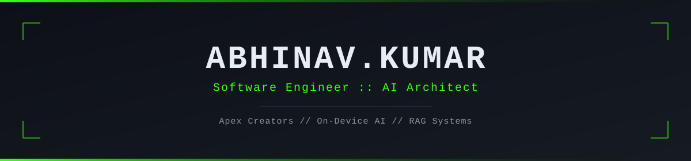

<div align="center">



[](https://www.linkedin.com/in/maihuabhinav/)
[](https://abhinavk454.github.io/)
[](https://dev.to/abhinavk454)
[](mailto:abhinav@apexcreators.co.in)

</div>

```json
{
  "name": "Abhinav Kumar",
  "role": "Software Engineer / AI Architect",
  "company": "Apex Creators",
  "location": "India",
  "experience": "7+ years",
  "status": "open to collaborate",

  "stack": ["LLMs", "RAG", "ExecuTorch", "LiteRT", "ONNX", "Python", "AWS", "Docker"],

  "featured": [
    "Examshala - AI adaptive learning platform -> examshala.in",
    "LocalAI - offline private AI app -> Google Play",
    "6 apps shipped on Google Play"
  ],

  "philosophy": "Ship, measure, improve."
}
```

</div>
